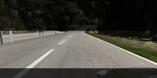
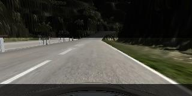
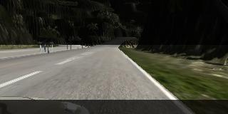
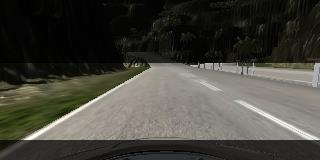

# Behavioral Cloning

The goals / steps of this project are the following:
* Use the simulator to collect data of good driving behavior
* Build, a convolution neural network in Keras that predicts steering angles from images
* Train and validate the model with a training and validation set
* Test that the model successfully drives around track one without leaving the road
* Summarize the results with a written report


## Rubric Points
Here I will consider the [rubric points](https://review.udacity.com/#!/rubrics/432/view) individually and describe how I addressed each point in my implementation.  

---
### Files Submitted & Code Quality

#### 1. Submission includes all required files and can be used to run the simulator in autonomous mode

My project includes the following files:
* ./model.py containing the script to create and train the model
* ./drive.py for driving the car in autonomous mode
* ./model.h5 containing a trained convolution neural network 
* ./output.mp4 video of a successful run around BOTH track tracks with a single model
* ./README.md this writeup summarizing the results

#### 2. Submission includes functional code
Using the Udacity provided simulator and my drive.py file, the car can be driven autonomously around the track by executing 
```sh
python drive.py model.h5
```

#### 3. Submission code is usable and readable

The model.py file contains the code for training and saving the convolution neural network. The file shows the pipeline I used for training and validating the model, and it contains comments to explain how the code works.

### Model & Training: overview

#### 1. An appropriate model architecture has been employed

My model architecture was inspired by the NVidia architecture described in https://devblogs.nvidia.com/parallelforall/deep-learning-self-driving-cars/ and consists of five convolutional layers of 5x5 and 3x3 filter sizes, depths between 24 and 64, all with Leaky-ReLU activations. 

The fully connected layers mimic the above NVidia architecture with the only difference, that I added two SpatialDropout2D with probability of 0.1 to prevent too much overfitting.

The model includes data normalization using a Keras lambda layer, where color channels are squeezed into the -16..+16 range to keep the default starting learning rate of Adam optimizer small compared to the input data.

#### 2. Attempts to reduce overfitting in the model

The model contains spatial dropout layers in order to reduce overfitting with probability of 0.1. 

The model was trained and validated on different data sets to ensure that the model was not overfitting. The model was tested by running it through the simulator and ensuring that the vehicle could stay on the track.

#### 3. Model parameter tuning

The model used an adam optimizer, so the learning rate was not tuned manually.
Other hyperparameters which have been tuned:
* side cameras correction angle
* cropping frame
* drop-out rate
* normalization range
* tried ReLU, LeakyReLU with various alpha, Parametric ReLU

#### 4. Appropriate training data

I have made a several attempts to collect the data, starting small and asking the model to generalize / guess the best course of action. At some point I got an interesting result on the first track with the rendering details set to the "Fantastic" level but very few training data.

For details about how I created the training data, see the next section. 

### Model & Training: details

#### 1. Model Design Approach

The overall strategy for deriving a model architecture was to start with a simple model, then adding convolutional layers one by one and gradually increasing the number of neurons in the fully connected layers watching the validation loss going down.

My first step was to use a convolutional neural network model similar to the AlexNet, then VGG, then the NVidia architecture. The latter one appeared to be most promising to me because of the simplicity, speed of training, and loss on validation set.

To reduce the amount of the noise coming from the upper and very bottom portions of the images, cropping was also added as the very first layer of the network.

The next layer is doing the normalization of the data, squeezing the color channels into the -16..+16 range.

In order to gauge how well the model was working, I split my image and steering angle data into a training and validation set. I found that my first model had a low mean squared error on the training set but a high mean squared error on the validation set. This implied that the model was overfitting. 

To combat the overfitting, I modified the model so that right after the last convolutional layer result was flattened, two SpatialDropout2D layers with 0.1 probability was fit in before the result goes to the fully connected layers.

After the initial review, the suggestions were to use some additional tools to improve the model's performance:
* SpatialDropout2D: I played with various places to insert it, but was not able to find a configuration where it would supersede the traditional Dropout on the flattened layer, untill I restructured my model to use Generators. Probably, because of different batch_size, now the SpatialDropout2D started making a good difference!
* LeakyReLU: In another experiment, I replaced ReLU with Leaky ReLU activations throughout the entire model: Despite the dynamic adjustment of learning rate within the Adam optimizer core, the fact that Leaky ReLU improved the performance, implies that there was a somewhat significant amount of "dead" neurons when the classical ReLUs were used.

With the LeakyReLUs the same model was able to perform well on both tracks!


#### 2. Final Model Architecture

The final model architecture consisted of a convolution neural network with the following layers and layer sizes:

| layer | size | activation |
| --- | --- | --- |
| Cropping2D | ((62,20),(0,0)) | |
| Lambda | | |
| Conv2D | 24x5x5 | LeakyReLU |
| Conv2D | 36x5x5 | LeakyReLU |
| Conv2D | 48x5x5 | LeakyReLU |
| Conv2D | 64x3x3 | LeakyReLU |
| SpatialDropout2D | 0.1 |  |
| Conv2D | 64x3x3 | LeakyReLU |
| SpatialDropout2D | 0.1 |  |
| Flatten | | |
| Dense | 1164 | LeakyReLU |
| Dense | 100 | LeakyReLU |
| Dense | 50 | LeakyReLU |
| Dense | 10 | LeakyReLU |
| Dense | 1 | |


#### 3. Creation of the Training Set & Training Process

To capture good driving behavior, I first recorded ONE lap on EACH track using center lane driving in clockwise direction, then one more lap per each track in the counterclockwise direction.

After initial training, I ran the autopilot and noted all the places where the vehicle was going off track, then drove through the problematic curves manually for a few times each in order to add them to the training dataset. The problematic spots  were driven in both directions.

To augment the dataset, I also flipped images and angles, and used side cameras thinking that this would increase the size of the training dataset and make the cases with fast turning better represented.







After the collection process and data augmentation, I had about 17k data points (50k images in training set). I finally randomly shuffled the data set and put 30% of the data into a validation set. 

The validation set helped determine if the model was over or under fitting. The ideal number of epochs was 3 as evidenced by stabilized validation_loss after the 3rd-4th epoch. I used an adam optimizer so that manually training the learning rate wasn't necessary.

#### 4. Notes

##### N.1.
During the experiments, I also played with the various settings of the Simulator Renderer quality: at some point I set the quality to "Fantastic" level and drove only one single lap in the opposite direction on the 1st track. The result was quite surprising: the car was able to successfully complete the lap! The only thing is that it found a legitimate shortcut through a dirt road which it took, and then successfully returned back to the track. 

After adding a lap driven in the "correct" direction, and a couple extra turns to the training set, the neural network was able to complete a full lap on the first track.

"Fantastic" quality though made things worse on the second track: "Fantastic" adds very dark shadows casted by the mountainous relief, which immediately throws off the model's predictions. A good option to cope with the dark shadows could be some local image normalization with a small kernel size. I didn't try it here as I could not find an easy way to do it in Keras, otherwise it would require some modifications to the drive.py so it does the same preprocessing before feeding the data into the model during inference...

So, for the second track, to make the model complete the lap, I had to use the "Fastest" quality recommended by the course materials which doesn't have shadows drawn.

##### N.2.
During the initial review it was noted that the color channels used in the Model.py are of BGR sequence, whereas the drive.py uses RGB. Expectation was that fixing this problem will greatly improve the performance during testing in the simulator. Surprisingly, after the bug was fixed, performance during the simulation did not change much. My guess is that this is due to a large number of convolutional layers which average the difference between R and B channels as the signal goes dipper through the filters, and also the fact that both tracks are run during the "day" time with relatively evenly "loaded" color channels.
